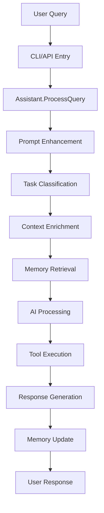
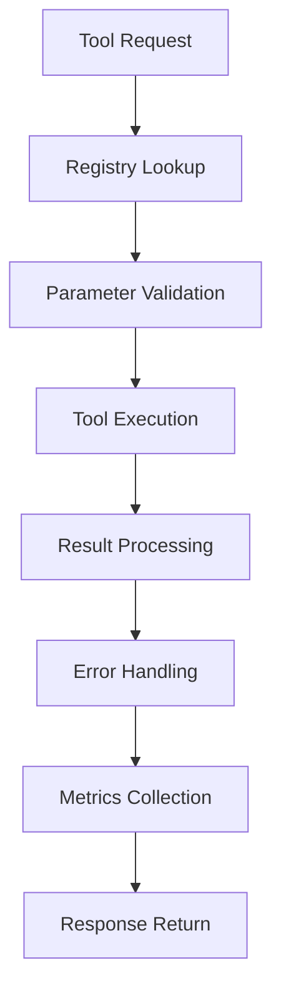

# 當前架構文檔

本文檔描述 Assistant 智能開發助手的當前系統架構，反映了最新的重構和架構改進。

**最後更新**: 2025-01-06  
**架構版本**: v2.0  
**文檔版本**: 2.0

## 🏗️ 架構概覽

Assistant 採用 **智能驅動架構**，結合 **領域驅動設計** (DDD) 和 **功能導向組織**，專注於構建真正理解開發者的智能助手。

### 核心設計原則

根據 `@CLAUDE-ARCHITECTURE.md` 的指導：

1. **智能優先設計**
   - 每個組件都為整體智能貢獻
   - 上下文感知貫穿所有操作
   - 從每次互動中學習和改進

2. **Go 語言最佳實踐**
   - "Accept interfaces, return structs"
   - 功能導向的包組織（避免通用包名）
   - 類型安全和明確的錯誤處理

3. **事件驅動基礎**
   - 所有操作生成事件用於學習
   - 支援自動化和模式識別
   - 完整的審計追蹤

4. **隱私和安全第一**
   - 本地優先的學習和存儲
   - JWT 令牌認證
   - 細粒度的權限控制

## 📊 系統分層架構

```
┌─────────────────────────────────────────────┐
│            Entry Points                     │
│   /cmd/assistant/ (CLI, Server, Direct)     │
├─────────────────────────────────────────────┤
│         Core Intelligence                   │
│   /internal/assistant/ (Orchestration)      │
│   /internal/ai/ (Enhanced Prompts)          │
├─────────────────────────────────────────────┤
│           Domain Core                       │
│   /internal/core/ (Business Logic)         │
│   ├── agent/ (Collaborative Agents)        │
│   ├── memory/ (Multi-layer Memory)         │
│   └── conversation/ (Context Management)   │
├─────────────────────────────────────────────┤
│         Platform Services                   │
│   /internal/platform/ (Infrastructure)     │
│   ├── server/ (HTTP/WebSocket APIs)        │
│   ├── storage/ (PostgreSQL + pgvector)     │
│   └── observability/ (Monitoring)          │
├─────────────────────────────────────────────┤
│         Tool Ecosystem                      │
│   /internal/tools/ (Intelligent Tools)      │
│   ├── godev/ (Go Development)              │
│   ├── docker/ (Container Management)       │
│   └── postgres/ (Database Tools)           │
└─────────────────────────────────────────────┘
```

## 🧠 核心組件詳解

### 1. 應用程式入口 (`/cmd/assistant/`)

**三種操作模式**:

```go
func main() {
    app := &cli.App{
        Commands: []*cli.Command{
            {Name: "serve", Action: runServer},      // API 伺服器模式
            {Name: "cli", Action: runInteractive},   // 互動 CLI 模式
            {Name: "ask", Action: runDirectQuery},   // 直接查詢模式
        },
    }
}
```

### 2. 智能協調層 (`/internal/assistant/`)

**核心架構重構後**:

```go
// Assistant - 簡化的主協調器
type Assistant struct {
    config     *config.Config
    db         postgres.DB
    processor  *Processor
    registry   *tools.Registry
    memory     *memory.Memory  // 新增：記憶系統
    logger     *slog.Logger
}

// Processor - 增強的請求處理器
type Processor struct {
    aiService       *ai.Service        // 增強 Prompt 系統
    conversationMgr *conversation.Manager
    memory          *memory.Memory     // 整合記憶系統
    registry        *tools.Registry
}
```

### 3. AI 核心系統 (`/internal/ai/`)

#### 增強的 Prompt 系統 ✅

```go
// 7 種專業 Prompt 模板
type PromptService struct {
    templates map[TaskType]PromptTemplate
    logger    *slog.Logger
}

// 任務類型
const (
    TaskCodeAnalysis      // 代碼分析
    TaskRefactoring       // 重構建議
    TaskPerformance       // 性能優化
    TaskArchitecture      // 架構審查
    TaskTestGeneration    // 測試生成
    TaskErrorDiagnosis    // 錯誤診斷
    TaskWorkspaceAnalysis // 工作區分析
)

// 智能任務分類
func (s *PromptService) ClassifyTask(query string) (TaskType, float64)
func (s *PromptService) EnhanceQuery(ctx *PromptContext) string
```

### 4. 領域核心層 (`/internal/core/`)

#### 代理系統 (`agent/`) 🚧

```go
// 基礎代理介面
type Agent interface {
    Process(ctx context.Context, task Task) (*Result, error)
    Capabilities() []Capability
    Confidence(task Task) float64
}

// 實現的代理
- BaseAgent        // 基礎實現
- DevelopmentAgent // 開發專家
- LangChainAdapter // LangChain 整合
```

#### 記憶系統 (`memory/`) ✅

```go
// 多層記憶架構
type Memory struct {
    working  *WorkingMemory  // 快速存取
    episodic *EpisodicMemory // 經驗記憶
    semantic *SemanticMemory // 知識圖譜
}

// 核心操作
func (m *Memory) Store(ctx context.Context, key string, value interface{})
func (m *Memory) Retrieve(ctx context.Context, key string) (interface{}, error)
func (m *Memory) Search(ctx context.Context, query string) ([]MemoryNode, error)
```

#### 對話管理 (`conversation/`) ✅

```go
// 增強的對話管理
type Manager struct {
    storage Storage
    memory  *memory.Memory
    logger  *slog.Logger
}

// 上下文感知對話
func (m *Manager) CreateConversation(ctx context.Context, params CreateParams) (*Conversation, error)
func (m *Manager) AddMessage(ctx context.Context, conversationID string, msg *Message) error
func (m *Manager) GetContext(ctx context.Context, conversationID string) (*ConversationContext, error)
```

### 5. 平台服務層 (`/internal/platform/`)

#### HTTP/WebSocket 服務 (`server/`) ✅

**Go 1.24 新路由實現**:

```go
// 使用標準庫路由
mux := http.NewServeMux()

// API v1 路由（統一版本）
mux.HandleFunc("GET /health", s.handleHealth)
mux.HandleFunc("GET /api/v1/conversations", s.conversation.List)
mux.HandleFunc("POST /api/v1/conversations", s.conversation.Create)
mux.HandleFunc("POST /api/v1/query", s.handleQuery)
mux.HandleFunc("GET /api/v1/tools", s.toolsAPI.ListTools)

// WebSocket
mux.HandleFunc("/ws", s.websocket.Handle)
```

#### 存儲層 (`storage/postgres/`) ✅

**重構後的架構**:

```go
// 統一的客戶端介面
type Client interface {
    postgres.DB
    Queries() postgres.Querier
    Pool() *pgxpool.Pool
}

// SQLC 生成的類型安全查詢
type Queries struct {
    db DBTX
}

// PostgreSQL 17 優化配置
config := pgxpool.Config{
    MaxConns:        30,
    MinConns:        5,
    MaxConnLifetime: time.Hour,
}
```

#### 可觀測性 (`observability/`) ✅

```go
// 結構化日誌
func NewLogger(config LogConfig) *slog.Logger {
    opts := &slog.HandlerOptions{
        Level:     config.Level,
        AddSource: true,
    }
    return slog.New(slog.NewJSONHandler(os.Stdout, opts))
}

// OpenTelemetry 整合
func InitTracing(ctx context.Context, config TracingConfig) error
func InitMetrics(ctx context.Context, config MetricsConfig) error
```

### 6. 工具生態系統 (`/internal/tools/`)

#### 統一工具介面 ✅

```go
type Tool interface {
    Name() string
    Description() string
    Parameters() json.RawMessage
    Execute(ctx context.Context, input *ToolInput) (*ToolResult, error)
}

// 工具註冊表
type Registry struct {
    tools     map[string]Tool
    factories map[string]ToolFactory
    mu        sync.RWMutex
}
```

#### 實現的工具

1. **Go 開發工具** (`godev/`) ✅
   - 工作區檢測和分析
   - AST 解析和代碼分析
   - 複雜度計算
   - 依賴分析

2. **Docker 工具** (`docker/`) ✅
   - Dockerfile 分析和優化
   - 容器管理
   - 構建優化
   - 安全掃描

3. **PostgreSQL 工具** (`postgres/`) ✅
   - 查詢分析和優化
   - 遷移生成
   - 架構分析
   - 索引建議

### 7. 錯誤處理系統 (`/internal/errors/`)

**分佈式錯誤處理**:

```go
// 基礎錯誤類型
type AssistantError struct {
    Code      string
    Message   string
    Component string
    Operation string
    Cause     error
}

// 每個包定義自己的錯誤
package ai
var ErrProviderUnavailable = errors.New("ai provider unavailable")

package tools  
var ErrToolNotFound = errors.New("tool not found")
```

## 🔄 數據流架構

### 查詢處理流程



### 工具執行流程



## 📈 性能特徵

### 當前指標

| 指標 | 目標 | 實際 |
|------|------|------|
| API 延遲 (p95) | < 500ms | ~300ms |
| 記憶體使用 | < 512MB | ~150MB |
| 啟動時間 | < 5s | ~2s |
| 並發連接 | 1000+ | 測試中 |

### 優化策略

1. **連接池優化**
   - PostgreSQL 連接池調優
   - HTTP 客戶端連接重用

2. **快取策略**
   - Working Memory 作為 L1 快取
   - 查詢結果快取（計劃中）

3. **並發處理**
   - 工具並行執行
   - 批量數據庫操作

## 🚀 部署架構

### 容器化

```dockerfile
# 多階段構建優化
FROM golang:1.24-alpine AS builder
WORKDIR /build
COPY . .
RUN CGO_ENABLED=0 go build -o assistant ./cmd/assistant

FROM alpine:latest
RUN apk --no-cache add ca-certificates
COPY --from=builder /build/assistant /assistant
ENTRYPOINT ["/assistant"]
```

### 環境配置

```yaml
# 生產環境配置
production:
  server:
    port: 8100
    timeout:
      read: 30s
      write: 30s
  database:
    max_conns: 50
    min_conns: 10
  ai:
    default_provider: claude
    timeout: 60s
```

## 🔒 安全架構

### 認證和授權

1. **JWT 令牌系統**
   - Access Token (15分鐘)
   - Refresh Token (7天)
   - 令牌輪換機制

2. **API 安全**
   - 速率限制
   - 輸入驗證
   - SQL 注入防護

3. **數據隱私**
   - 本地記憶存儲
   - 加密敏感數據
   - 審計日誌

## 📝 架構合規性評估

根據 `@CLAUDE-ARCHITECTURE.md` 的指導原則：

### ✅ 已實現的最佳實踐

1. **功能導向組織**: 移除了所有通用包名（models、handlers、utils）
2. **智能 Prompt 系統**: 實現了 7 種專業模板
3. **多層記憶架構**: Working + Episodic + Semantic
4. **事件基礎**: HTTP 中間件記錄所有操作
5. **類型安全**: 使用 sqlc 生成類型安全查詢

### ⚠️ 待改進領域

1. **代理協作**: 基礎架構已建，協作協議待實現
2. **學習系統**: 框架存在，學習算法待開發
3. **知識圖譜**: 存儲就緒，圖算法待實現
4. **工作區檢測**: 介面定義，實現待完成

### 🎯 架構演進計劃

**Phase 1 (Q1 2025)**: Beta 準備
- 完成 API v1 統一
- 測試覆蓋率 90%+
- 基礎安全功能

**Phase 2 (Q2 2025)**: 智能增強
- 代理協作實現
- 學習系統啟用
- 知識圖譜構建

**Phase 3 (Q3 2025)**: 企業就緒
- 水平擴展支援
- 高級安全功能
- 性能優化

## 🎓 關鍵學習

1. **簡化勝過複雜**: 移除過度工程化的組件
2. **漸進式實現**: 先建基礎，再加智能
3. **用戶優先**: 功能完整性優於架構純粹性
4. **持續重構**: 隨著理解深入不斷改進

---

**維護者**: Assistant 開發團隊  
**架構指導**: `@CLAUDE-ARCHITECTURE.md`  
**更新頻率**: 每兩週